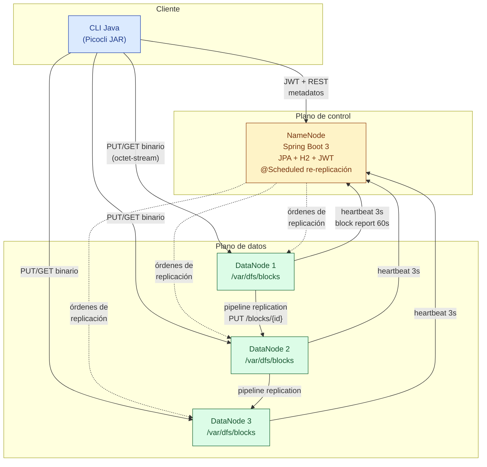
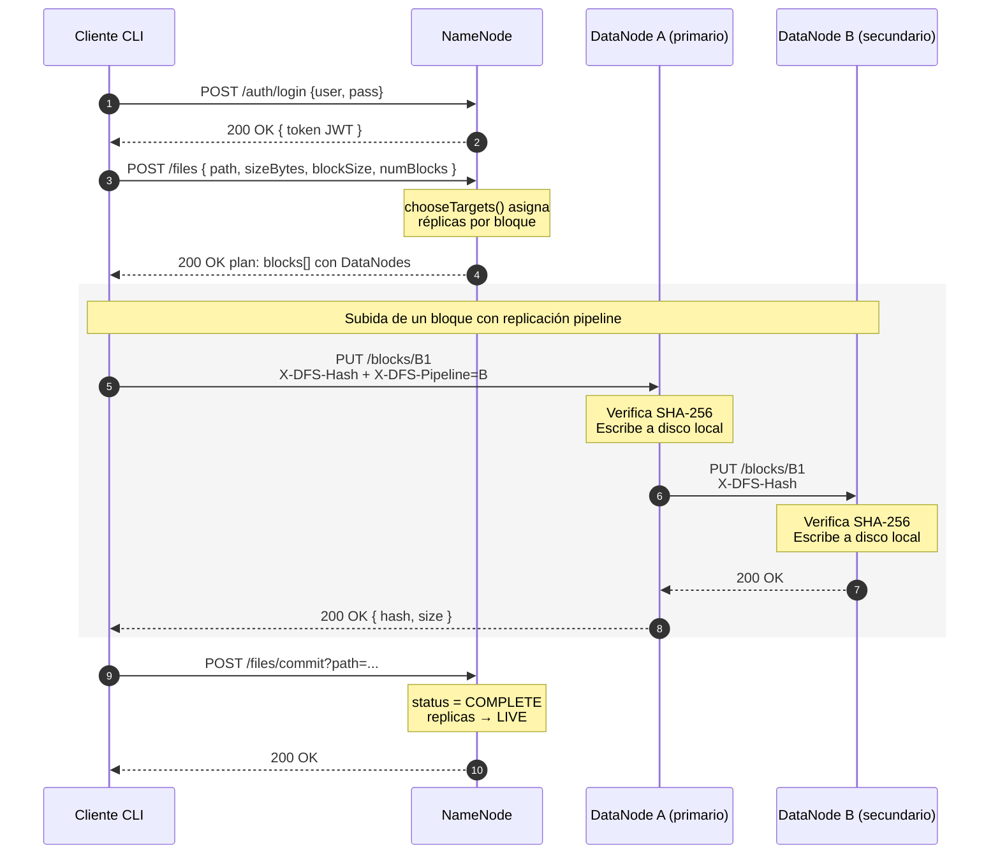
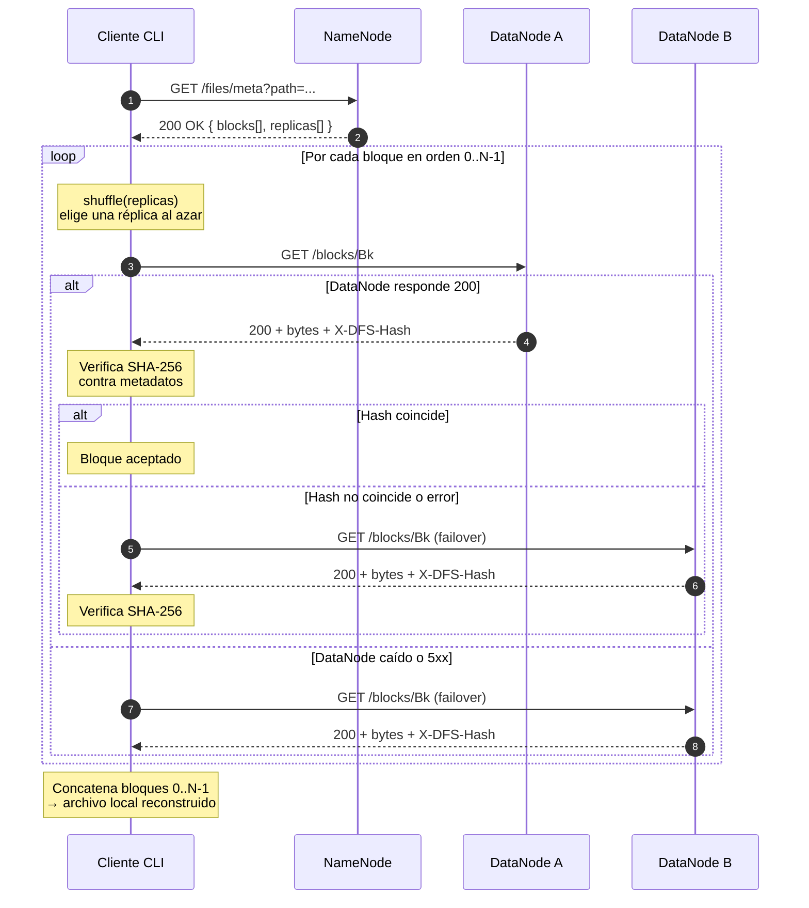
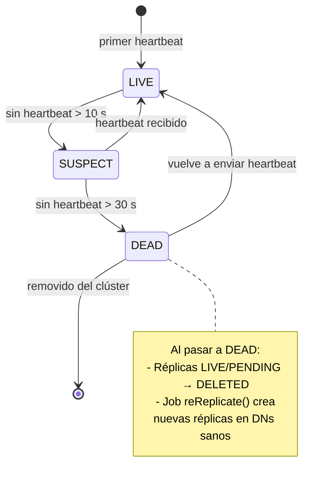
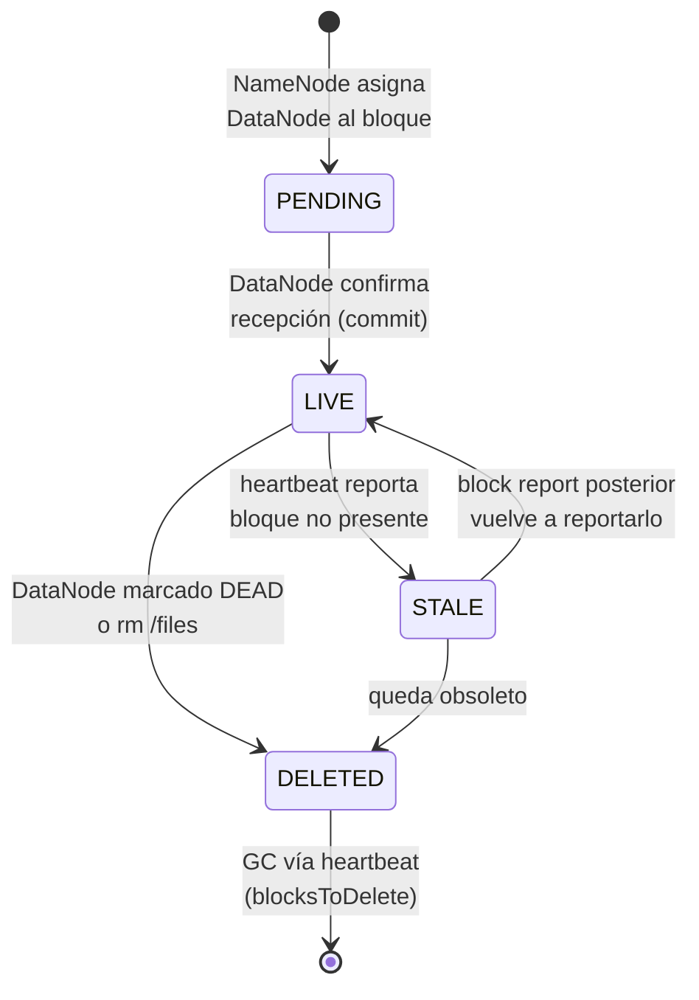
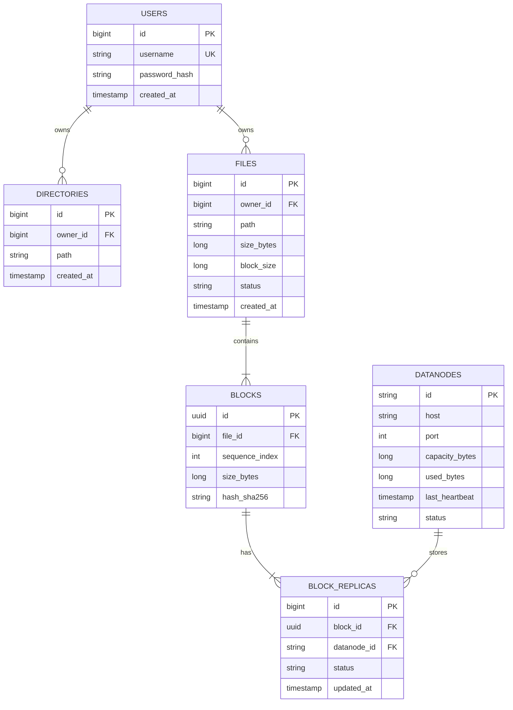

# Arquitectura — DFS-UPB

## 1. Visión general

Sistema de archivos distribuido por bloques, semántica WORM, arquitectura
Maestro–Trabajador inspirada en GFS/HDFS.

* **Cliente CLI**: punto de entrada del usuario; particiona, calcula hash y
  envía/recupera bloques. Se autentica contra el NameNode y arrastra el JWT
  obtenido a las llamadas a DataNodes.
* **NameNode**: servidor central de metadatos. Mantiene namespace, mapa
  archivo→bloques→DataNodes, asigna réplicas, recibe heartbeats/block reports
  y orquesta re-replicación.
* **DataNode** (≥3): almacena bloques en disco local, ejecuta replicación
  pipeline al recibir un PUT, expone GET con verificación SHA-256, y reporta
  estado al maestro.

## 2. Componentes y responsabilidades

| Componente | Lenguaje / Stack | Responsabilidades |
|------------|------------------|-------------------|
| NameNode   | Java 17, Spring Boot 3, Spring Data JPA + H2 | Auth (BCrypt + JWT), namespace (mkdir/rmdir/ls), files (create/commit/get/delete), asignación de DataNodes, detección de fallos, re-replicación, GC de réplicas. |
| DataNode   | Java 17, Spring Boot 3 | Almacenamiento físico de bloques, validación SHA-256, replicación pipeline, heartbeat + block report, GC dirigido por el NameNode. |
| Cliente    | Java 17 + Picocli (JAR shadeado) | Particiona archivos, sube a DataNode primario con header `X-DFS-Pipeline` para arrastrar la cadena, descarga con failover entre réplicas y verifica integridad. |

## 3. Diagrama de componentes



## 4. Diagrama de secuencia: PUT



## 5. Diagrama de secuencia: GET



## 6. Detección de fallos y re-replicación



* Cada DataNode envía heartbeat cada `heartbeat-interval-seconds` (default 3 s).
* El NameNode marca `SUSPECT` tras `HB_SUSPECT_SECONDS` (10 s) y `DEAD` tras
  `HB_DEAD_SECONDS` (30 s). Cuando un DN pasa a `DEAD`, todas sus réplicas
  `LIVE` se marcan `DELETED`, lo que baja el factor efectivo de los bloques
  afectados.
* Un job programado en el NameNode (`reReplicate`, cada
  `rereplication-interval-seconds`) busca bloques `LIVE_count < replication`,
  selecciona un DN saludable distinto, y le envía una orden
  `POST /blocks/{id}/replicate` a un DN que aún tenga el bloque, el cual lo
  copia al destino con `PUT /blocks/{id}` (incluyendo el hash).
* Cuando el destino confirma, el NameNode actualiza la réplica como `LIVE`.

## 7. Ciclo de vida de una réplica



## 8. Manejo de bloques corruptos

* El cliente verifica SHA-256 en cada bloque descargado. Ante mismatch,
  reintenta automáticamente con la siguiente réplica (failover transparente).
* Los DataNodes verifican SHA-256 al recibir un bloque; descartan ante
  mismatch con HTTP 400.
* En caso de corrupción detectada por el cliente, podría notificarse al
  NameNode para forzar re-replicación. Para mantener el alcance, esta
  notificación está cableada como endpoint placeholder; el job de
  re-replicación recoge las réplicas que ya estén marcadas `STALE/DELETED`.

## 9. Algoritmo de asignación de DataNodes

Para cada bloque, el `DataNodeService` calcula un score por DN vivo:

```
score = α · (capacidad_libre / capacidad_total) − β · asignaciones_recientes
```

con `α=1.0` y `β=0.1` por defecto. Selecciona los `replication-factor`
DataNodes con mayor score y, entre bloques consecutivos, rota cuál es el
primario para evitar hot-spots.

## 10. Persistencia de metadatos (NameNode)

H2 embebido (archivo `${DATA_DIR}/namenode-db.mv.db`). Modelo entidad-relación:



## 11. Comunicaciones

Todas las APIs son **REST sobre HTTP** con JSON para metadatos y transferencia
binaria directa para bloques (`PUT/GET /blocks/{id}`). El cuerpo de los PUT
de bloque es `application/octet-stream`; los headers `X-DFS-Hash` y
`X-DFS-Pipeline` controlan integridad y replicación pipeline respectivamente.

JWT **HS384** con clave compartida (`JWT_SECRET`); validado localmente por
cada componente. Esto evita un cuello de botella en el NameNode al validar
tokens en cada request a DataNode.
